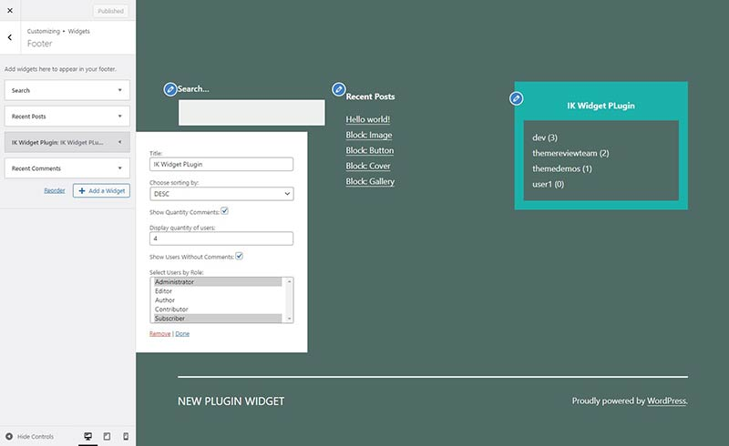

# ik-widget-plugin
Adds a new widget. The widget displays a list of users of the site sorted by the number of comments.
1. Опція, яка вказує показувати кількість коментарів у списку або ні (кількість вказуються після імені юзера в дужках).
2. Поле для кількості юзерів що виводяться в списку.
3. Опція - виводити юзерів у яких 0 коментарів чи ні. Для прикладу, якщо потрібно вивести 10 юзерів, а коменти писали тільки 6-ро, то ця опція повинна вказувати виводити тільки цих 6 юзерів чи вивести ще додаткових 4 юзера без коментарів.
4. Кольорова гама списку повинна залежати від вибраної гами теми. Тобто якщо вибрана темна тема список теж повинен бути з відповідним заднім фоном і кольором тексту (при застосуванні на одній із стандартних тем вордпресу).
5. Можливість вибрати тільки юзерів певної ролі, або декількох ролей (необовязково)

